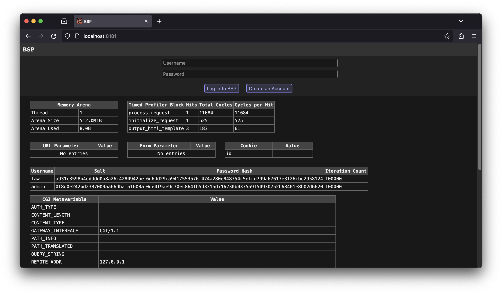

BSP Web Application
===================

A web application written in C99. The project is motivated by a desire to
understand the mechanics behind a typical web application at a lower level than
typically encountered in modern technology stacks for the web. For that reason,
basic features are intentionally coded by hand in a verbose, inefficient style
(from the perspective of both the programmer and processor).




Dependencies
------------

Project dependencies are kept to a minimum for the reasoning outlined
above. Current exceptions to this rule include:

- fcgi (for request processing via FastCGI protocol)
- spawn-fcgi (for binding the application to a port number)


Build and Deployment
--------------------

By default, the executable and data assets will be deployed to the directory
`/srv/bsp` on Linux and macOS. This can be configured by updating the value of
`DEPLOYMENT_PATH` in the provided Makefile. Ensure this directory exists before
initiating a build.

To build on Linux or macOS, navigate to the code directory and run:

```
make
```

This will compile a clean development build of the entire project (using clang),
copy the web application to the directory specified by `DEPLOYMENT_PATH`, and
restart the application (using spawn-fcgi) on the port specified by
`APPLICATION_PORT` in the Makefile. To compile an optimized build, instead run:

```
make production
```

In order to build on Windows, it is necessary to acquire a copy of the header
file fcgiapp.h (to be added to the code directory) and the library files
libfcgi.lib and libfcgi.dll (to be added to the build directory).

To build, navigate to the code directory using a Command Prompt that has
initialized the MSVC command-line build tools. From there, run the command:


```
build.bat
```

By default, the resulting build artifacts will be placed in
`d:\inetpub\bsp`. For the Windows build, the executable must be run manually
from the command line or a debugger.

BSP does not currently implement its own web server. A sample server entry for
nginx is provided in the misc directory.